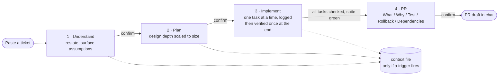

<h1 align="center">Breadcrumbs</h1>

<p align="center"><em>Sessions end. The trail doesn't.</em></p>

Hansel and Gretel had the right idea: don't trust the path to remember itself, drop something behind you that will. A user story rarely survives contact with reality unchanged — assumptions get filled in, scope shifts, a test turns up an edge case nobody planned for. The reasoning behind those changes doesn't survive either, unless someone writes it down while it's still fresh.

Breadcrumbs runs a user story from a pasted ticket to a PR-ready implementation through four gated steps, and drops a trail of what got decided and why along the way. Pick the work back up in a new session, on a new machine, even on a different AI platform, and it's all still there — nobody has to reconstruct it from a diff.

## Before / after

Say you paste `PARK-482: fix duplicate charge on payment retry`. Three tasks in, a test fails: turns out retries need a second idempotency guard too, unrelated to the original bug. Scope changes on the spot. You stop for the day with two tasks left.

**Without breadcrumbs**, tomorrow's session — or a teammate's, or a different AI entirely — starts from the diff alone. It can't tell the idempotency guard was a deliberate scope change rather than scope creep, so it either re-litigates a decision that's already settled or ships past it with no idea why the code looks the way it does. Whoever writes the PR description is reconstructing it from what's left on screen, and the reviewer who asks "why is this written this way?" next month gets a shrug.

**With breadcrumbs**, that session opens with:
> *Here's where this stood: PARK-482, Step 3 of 4, 3/5 tasks done. Scope changed on 2026-08-11 — retries also needed a second idempotency guard, unrelated to the original bug. Two tasks left: add the guard, add regression coverage.*

No re-reading the diff, no guessing at intent — the trail just picks up where it left off, on whatever machine or platform happens to be open.

| | Without | With breadcrumbs |
|---|---|---|
| Resuming after a break | Re-read the diff, guess at intent | Reads the trail, states exactly where it stood |
| Mid-flight scope change | Buried in scrollback, easy to lose | Logged with before/after/why the moment it happens |
| Switching AI tools or machines | Starts from zero | Any platform reading the file picks up identically |
| "Why is this written this way?" | Reconstructed from memory of a diff | Task Log's original reasoning, not a retrofit |
| PR description | Written after the fact from what's left | Pulled straight from the trail — What/Why/Test/Rollback/Dependencies |

## How it works

Every story runs through four gates, confirmed with you at each one:



Nothing hits disk until it has to — a story that wraps up in one sitting never gets a file at all, which is the normal case, not something falling through the cracks. A context file only shows up once the work needs to outlast the current conversation:


Once a file exists, it also tracks the story's **Flow**, the set of files the plan expects to touch, decided once up front at planning. A hand-edit that lands somewhere the plan didn't expect gets flagged rather than quietly folded in.

## Install

### Claude Code

```
/plugin marketplace add alias01/breadcrumbs
```
```
/plugin install breadcrumbs@breadcrumbs
```
(two separate prompts — the second won't find the marketplace until the first completes)

Breadcrumbs also plugs into a `UserPromptSubmit` hook ([`hooks/detect-story.mjs`](hooks/detect-story.mjs)) that recognizes ticket-shaped prompts and nudges toward the skill automatically, instead of relying on you to invoke it.

### Cursor / Windsurf / Cline / Kiro / GitHub Copilot

No package manager — copy the matching rule file from this repo into your project:

| Platform | File |
|---|---|
| Cursor | [`.cursor/rules/breadcrumbs.mdc`](.cursor/rules/breadcrumbs.mdc) |
| Windsurf | [`.windsurf/rules/breadcrumbs.md`](.windsurf/rules/breadcrumbs.md) |
| Cline | [`.clinerules/breadcrumbs.md`](.clinerules/breadcrumbs.md) |
| Kiro | [`.kiro/steering/breadcrumbs.md`](.kiro/steering/breadcrumbs.md) |
| GitHub Copilot | [`.github/copilot-instructions.md`](.github/copilot-instructions.md) |

### Everything else

Any tool that reads [`AGENTS.md`](AGENTS.md) from the project root picks up breadcrumbs with no setup — Codex, Amp, Jules, JetBrains Junie (once pointed at the file), and others.

### Optional companions

Two skills breadcrumbs prefers when they're installed, both degrading cleanly when they aren't:

- [**ponytail**](https://github.com/DietrichGebert/ponytail) — how code gets written during Implement. Breadcrumbs owns the process and the trail, ponytail owns keeping the diff small. Absent → Step 3 falls back to plain simplest-thing-that-works.
- **graphify** — repo investigation during Understand and Plan. A knowledge-graph query answers "what relates to what" more cheaply than grep can. Absent → investigation falls back to targeted grep and scoped reads.

## Development

[`skills/breadcrumbs/SKILL.md`](skills/breadcrumbs/SKILL.md) is the canonical source. Every other platform file is generated from it — edit `SKILL.md`, then re-run:

```bash
node scripts/build-platforms.mjs            # regenerate the platform files in-repo
node scripts/build-platforms.mjs --install  # ...and refresh ~/.claude/skills/breadcrumbs
```

`--install` is opt-in because it writes outside the repo. Claude Code loads the skill by name from `~/.claude/skills/breadcrumbs`, a separate copy from this repo's `skills/breadcrumbs/` — repo edits are invisible at runtime until you pass it.

The two validators have unit tests, and CI checks that the generated files above haven't drifted from `SKILL.md`:

```bash
node --test "skills/breadcrumbs/tests/**/*.test.mjs"
```

[`skills/breadcrumbs/tests/scenarios.md`](skills/breadcrumbs/tests/scenarios.md) covers the rest — the prompt-following behavior, which has no deterministic output to assert on. Run those by hand in a scratch repo after editing `SKILL.md` or a step file.

[`skills/breadcrumbs/context-template.md`](skills/breadcrumbs/context-template.md) defines the context file's structure and guardrails; it gets inlined into the generated platform files (they have no on-demand file-loading, unlike Claude Code, which reads it only once per story).

### Releasing

Versioning is manual — [`VERSION`](VERSION) is the single source of truth, read by `build-platforms.mjs` into the generated `plugin.json`.

```bash
# 1. Bump the version by hand
echo "1.1.0" > VERSION

# 2. Generate the CHANGELOG.md entry from commits since the last tag
node scripts/generate-changelog.mjs

# 3. Review/edit the generated section, then rebuild and commit
node scripts/build-platforms.mjs
git add VERSION CHANGELOG.md .claude-plugin/plugin.json
git commit -m "chore(release): v1.1.0"

# 4. Tag and push — this triggers the release workflow
git tag v1.1.0
git push origin main v1.1.0
```

[`.github/workflows/release.yml`](.github/workflows/release.yml) creates the GitHub Release automatically on tag push, using the matching `CHANGELOG.md` section as release notes.

## FAQ

**Does every story get a context file?**
No — most stories finish in one sitting and never touch disk.

**What if I'm running several stories at once?**
Resuming checks `.breadcrumbs/context/` for existing files. More than one candidate and your prompt doesn't clearly point to one → it lists them (filename, title, status — a cheap partial read, not a full one) and asks which.

**Does it slow down small fixes?**
Bug fixes and copy/config changes run in lite mode: no context file, no design step, a two-task ceiling. Full rigor only kicks in if something mid-flight actually needs it.

**Why "breadcrumbs"?**
Because what matters isn't the story itself — it's being able to find your way back to it.

## License

[MIT](LICENSE).
