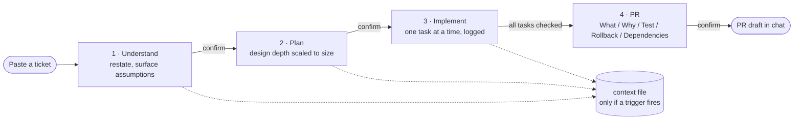
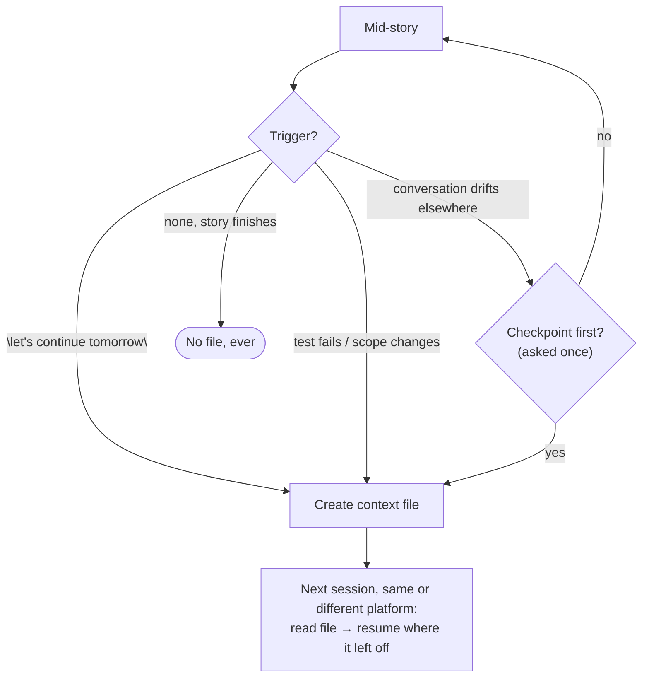

<h1 align="center">Breadcrumbs</h1>

<p align="center"><em>Sessions end. The trail doesn't.</em></p>

Hansel and Gretel had the right idea: don't trust the path to remember itself, drop something behind you that will. A user story rarely survives contact with reality unchanged — assumptions get filled in, scope shifts, a test turns up an edge case nobody planned for. The reasoning behind those changes doesn't survive either, unless someone writes it down while it's still fresh.

Breadcrumbs runs a user story from a pasted ticket to a PR-ready implementation through four gated steps, and drops a trail of what got decided and why along the way. Pick the work back up in a new session, on a new machine, even on a different AI platform, and it's all still there — nobody has to reconstruct it from a diff.

## Before / after

Say you paste `PARK-482: fix duplicate charge on payment retry`. Three tasks in, a test fails: turns out retries need a second idempotency guard too, unrelated to the original bug. Scope changes on the spot. You stop for the day with two tasks left.

**Without breadcrumbs**, tomorrow's session — or a teammate's, or a different AI entirely — starts from the diff alone. It can't tell the idempotency guard was a deliberate scope change rather than scope creep, so it either re-litigates a decision that's already settled or ships past it with no idea why the code looks the way it does. Whoever writes the PR description is reconstructing it from what's left on screen, and the reviewer who asks "why is this written this way?" next month gets a shrug.

**With breadcrumbs**, that session opens with:
> *Here's where this stood: PARK-482, Step 3 of 4, 3/5 tasks done. Scope changed on 2026-08-11 — retries also needed a second idempotency guard, unrelated to the original bug. Two tasks left: add the guard, add regression coverage.*

No re-reading the diff, no guessing at intent — the trail just picks up where it left off, on whatever machine or platform happens to be open.

| | Without | With breadcrumbs |
|---|---|---|
| Resuming after a break | Re-read the diff, guess at intent | Reads the trail, states exactly where it stood |
| Mid-flight scope change | Buried in scrollback, easy to lose | Logged with before/after/why the moment it happens |
| Switching AI tools or machines | Starts from zero | Any platform reading the file picks up identically |
| "Why is this written this way?" | Reconstructed from memory of a diff | Task Log's original reasoning, not a retrofit |
| PR description | Written after the fact from what's left | Pulled straight from the trail — What/Why/Test/Rollback/Dependencies, plus Reviewer focus / Out of scope when earned |

## How it works

Every story runs through four gates, confirmed with you at each one:



Nothing hits disk until it has to — a story that wraps up in one sitting never gets a file at all, which is the normal case, not something falling through the cracks. A context file only shows up once the work needs to outlast the current conversation:



Once a file exists, it also tracks the story's **Flow**, the set of files the plan expects to touch, decided once up front at planning. A hand-edit that lands somewhere the plan didn't expect gets flagged rather than quietly folded in.

## Install

### Claude Code

```
/plugin marketplace add alias01/breadcrumbs
```
```
/plugin install breadcrumbs@breadcrumbs
```
(two separate prompts — the second won't find the marketplace until the first completes)

The plugin also registers two hooks: a `UserPromptSubmit` hook ([`hooks/detect-story.mjs`](hooks/detect-story.mjs)) that recognizes ticket-shaped prompts and nudges toward the skill automatically, and a `PreToolUse` guard ([`hooks/guard-stash.mjs`](hooks/guard-stash.mjs)) that denies `git stash`, `checkout --`, `restore` and `revert` outright. The guard exists because "write the regression test first, never stash the fix to prove it fails" held as prose in one of three measured runs — the other two shelved the finished fix, reran the suite to see the test go red, then brought it back, at a cost of 6–10 extra calls each time. Working from a checkout of this repo instead of the plugin → the same hooks are wired in [`.claude/settings.json`](.claude/settings.json).

### Cursor / Windsurf / Cline / Kiro / GitHub Copilot

No package manager — copy the matching rule file from this repo into your project:

| Platform | File |
|---|---|
| Cursor | [`.cursor/rules/breadcrumbs.mdc`](.cursor/rules/breadcrumbs.mdc) |
| Windsurf | [`.windsurf/rules/breadcrumbs.md`](.windsurf/rules/breadcrumbs.md) |
| Cline | [`.clinerules/breadcrumbs.md`](.clinerules/breadcrumbs.md) |
| Kiro | [`.kiro/steering/breadcrumbs.md`](.kiro/steering/breadcrumbs.md) |
| GitHub Copilot | [`.github/copilot-instructions.md`](.github/copilot-instructions.md) |

### Everything else

Any tool that reads [`AGENTS.md`](AGENTS.md) from the project root picks up breadcrumbs with no setup — Codex, Amp, Jules, JetBrains Junie (once pointed at the file), and others.

Works alongside the [ponytail](https://github.com/DietrichGebert/ponytail) skill for how code gets written during the Implement step — breadcrumbs owns the process and the trail, ponytail owns keeping the diff small.

### Where the tokens go

The rule file is a router: ~2k tokens, loaded only when a story is in play (agent-requested on Cursor, model-decision on Windsurf, manual on Kiro). Each step file is read once, at its gate. That is the whole cost breadcrumbs adds to a turn.

A usage dashboard that shows lakhs of tokens for one request is not showing context size — it sums input over *every model call in the agentic loop*, and each call re-sends the full context. Thirty tool calls at 60k context is 1.8M billed tokens while the context meter never moves past 60k. Two things drive that number:

- **Fixed cost per call**, paid on every tool call whether or not a story is running: the platform's tool definitions, every MCP server's tools, every always-apply rule, every skill description. On a typical Cursor setup this is 10–15k per call — trim MCP servers you're not using and keep rules agent-requested rather than always-on. Breadcrumbs is already the latter.
- **Growth per call**, which is what the skill can bound: whole-file reads, verbose test output, big diffs. The router's *Output budget* rule keeps reads to the line range a search found, runs tests quiet and scoped per task, and saves the full suite for the Step 3.8 gate.

Neither helps a chat that has already grown. Start a new chat per story and let the context file carry what the next one needs — that is the point of the trail.

## Development

[`skills/breadcrumbs/SKILL.md`](skills/breadcrumbs/SKILL.md) is the canonical source. Every other platform file is generated from it — edit `SKILL.md`, then re-run:

```bash
node scripts/build-platforms.mjs
```

[`skills/breadcrumbs/context-template.md`](skills/breadcrumbs/context-template.md) defines the context file's structure and guardrails.

**Build profiles.** The generated files come in two shapes:

```bash
node scripts/build-platforms.mjs                  # lean (default)
node scripts/build-platforms.mjs --profile=full   # inline everything
```

*Lean* ships the router and leaves the step files as repo-relative pointers the agent reads at each gate — ~2k tokens per platform file instead of ~10.9k. *Full* inlines everything: bigger, but nothing depends on the agent choosing to follow a pointer.

Lean is a real trade. A pointer is a soft instruction, and a weaker model may skip it. It's managed by what stays in the router — the four gates, "never skip a gate", lite-mode rules, the verification requirement and the context-file triggers are all inline, so a skipped reference read costs plan *depth*, not a gate. If a platform ignores the pointers outright, rebuild with `--profile=full`.

Two files ignore the flag: [`AGENTS.md`](AGENTS.md) is always full (it's the fallback for tools that can't read files on demand), and `.windsurf/rules/breadcrumbs.md` is always lean (Windsurf enforces a 12,000-char cap and truncates past it silently — the build fails rather than ship a half-skill).

**Local Claude Code copy.** Claude Code loads skills from `~/.claude/skills/`, not from this repo, so edits here are invisible at runtime until that copy is refreshed. The build never touches it on its own — pass `--install` when you want it synced:

```bash
node scripts/build-platforms.mjs --install
```

### Releasing

[`docs/decisions.md`](docs/decisions.md) records why the non-obvious calls were made — the Windsurf cap, why pointers are plain paths rather than `@file`, what `--profile=full` is for — plus what's still unverified. Read it before "fixing" something in the build that looks wrong.

Versioning is manual — [`VERSION`](VERSION) is the single source of truth, read by `build-platforms.mjs` into the generated `plugin.json`.

```bash
# 1. Bump the version by hand
echo "1.1.0" > VERSION

# 2. Generate the CHANGELOG.md entry from commits since the last tag
node scripts/generate-changelog.mjs

# 3. Review/edit the generated section, then rebuild and commit
node scripts/build-platforms.mjs
git add VERSION CHANGELOG.md .claude-plugin/plugin.json
git commit -m "chore(release): v1.1.0"

# 4. Tag and push — this triggers the release workflow
git tag v1.1.0
git push origin main v1.1.0
```

[`.github/workflows/release.yml`](.github/workflows/release.yml) creates the GitHub Release automatically on tag push, using the matching `CHANGELOG.md` section as release notes.

## FAQ

**Does every story get a context file?**
No — most stories finish in one sitting and never touch disk.

**What if I'm running several stories at once?**
Resuming checks `.breadcrumbs/context/` for existing files. More than one candidate and your prompt doesn't clearly point to one → it lists them (filename, title, status — a cheap partial read, not a full one) and asks which.

**Does it slow down small fixes?**
Bug fixes and copy/config changes run in lite mode: no context file, no design step, a two-task ceiling. Full rigor only kicks in if something mid-flight actually needs it.

**Why "breadcrumbs"?**
Because what matters isn't the story itself — it's being able to find your way back to it.

## License

[MIT](LICENSE).
